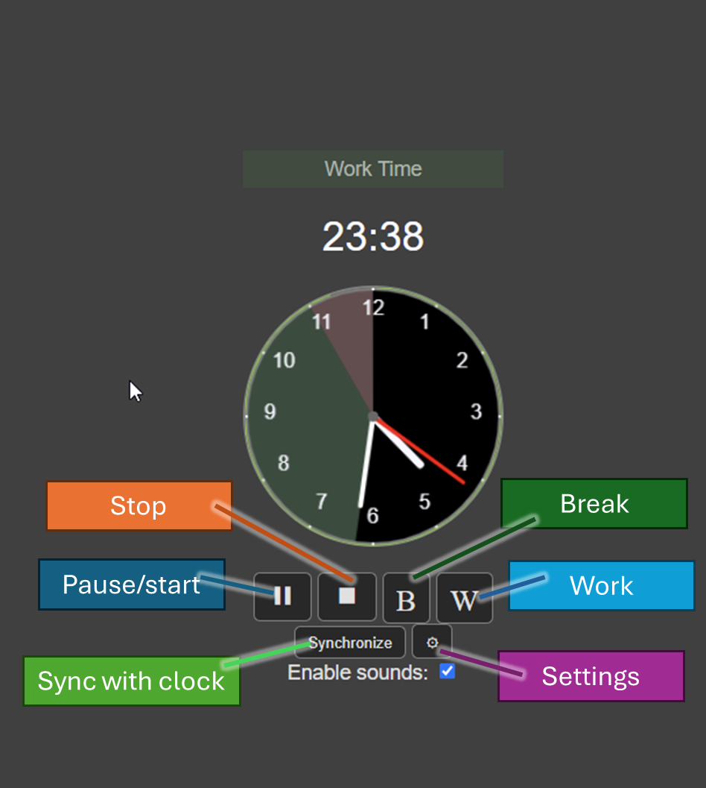

# webClock0doro

Web Clock0doro is an attempt to bring Clock0doro to the web, mainly as cross-platform alternative to the current Clock0doro windows app.

Based on Pomodoro technique, mainly work time (typ. 25 minutes) and break time (typ. 5 minutes), it becomes possible to adjust your time accordingly. 

The interface, like its main form, is very straightforward. Settings allows you adjust the break and work time according to the wishes. 

## Trivia
Initially, Clock0doro was initialized by me and asked ChatGPT to make a code, which I had to wholly refix. What I have done is asking Claude AI to convert the VB.NET into JQuery/Javascript, then asked ChatGPT to document it. Based on both input, I updated the code and doc accordingly.

[Link to Web Clock0Doro (Online version)](https://kallelay.github.io/webClock0doro/src/clock0doro1.html)

Original Desktop application: https://github.com/kallelay/clock0doro

